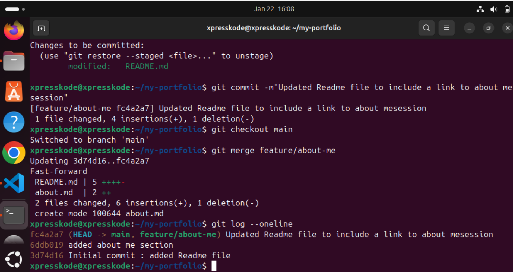
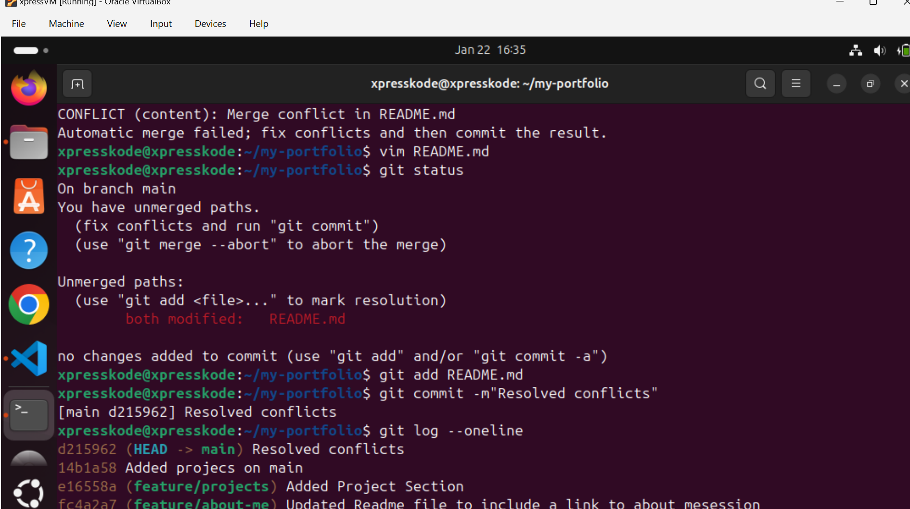
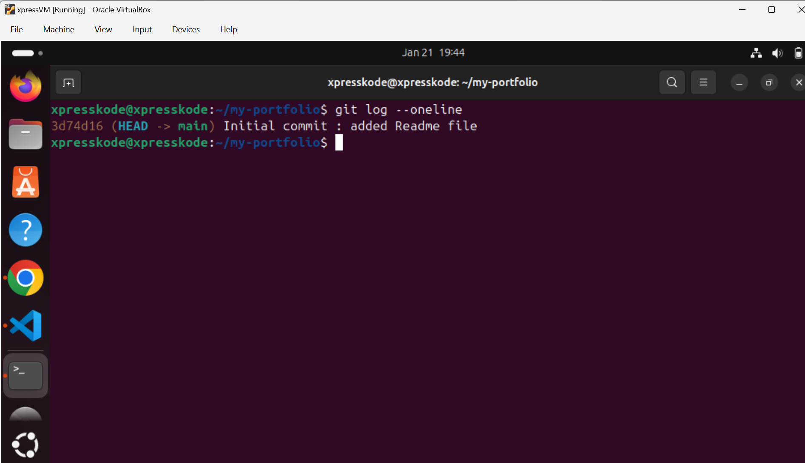
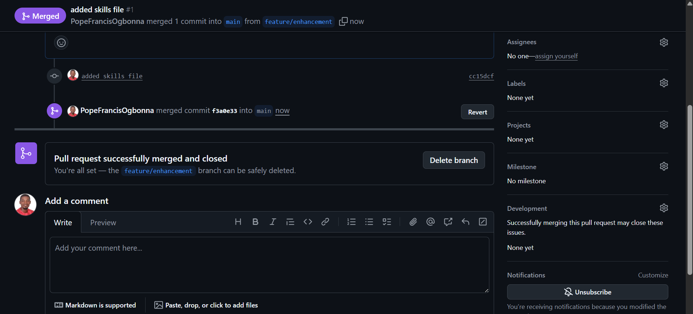
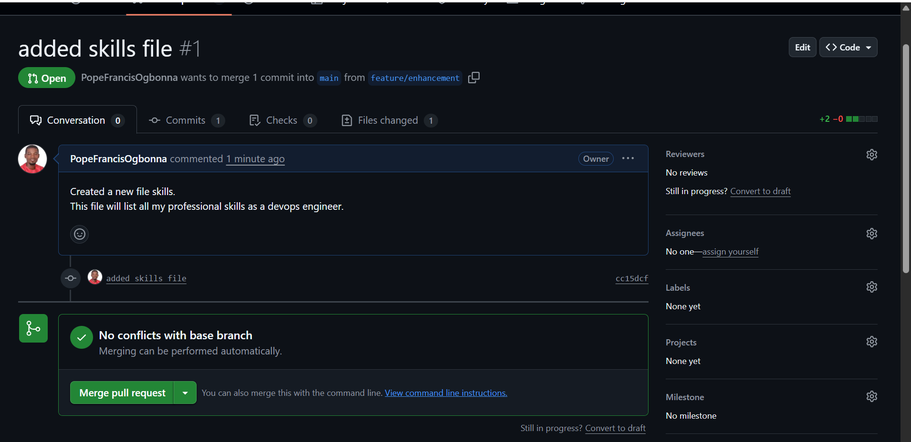
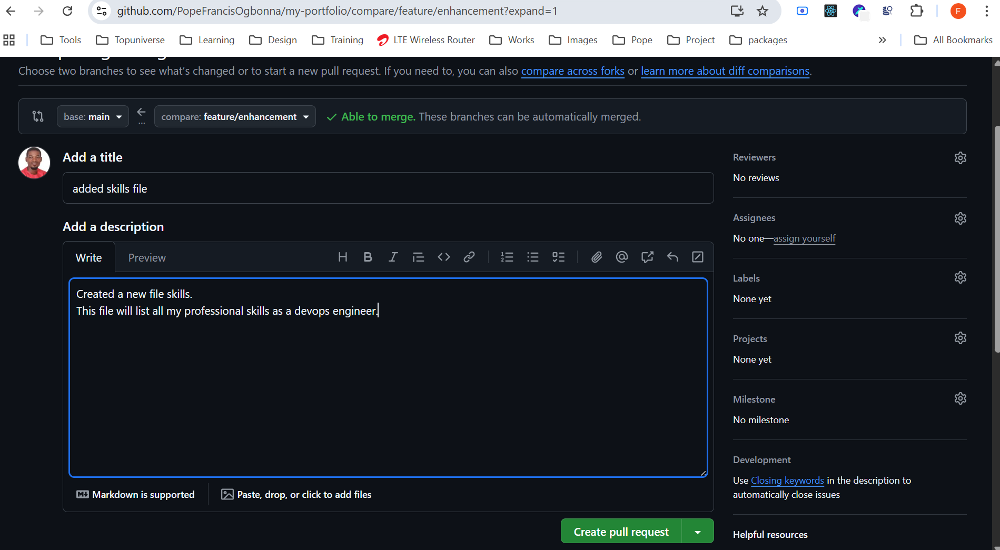

# Git Lab Report
## Screenshots

    

## Reflection
This lab helped me understand branching, merging, and conflict resolution.
The merge conflict section was the most challenging but showed how Git manages team collaboration.
It has significantly deepened my practical understanding of Git as a collaboration tool rather than just a version control system. Working with feature branches reinforced the importance of isolating every single changes to prevent breaking the main codebase, while merging shows how various contributions can be safely integrated. The merge conflict exercise was the most challenging part of the lab, as it required careful review of conflicting changes and deliberate decision-making instead of relying on automated tools. Resolving the conflict manually helped me understand how Git tracks file history and why clear communication and structured workflows are critical in team environments.

Additionally, using GitHub pull requests showed how code reviews, approvals, and controlled merges improve code quality and accountability in DevOps teams. Overall, this lab connected Git concepts to real-world DevOps practices, highlighting how proper branching strategies, meaningful commit messages, and collaborative reviews reduce deployment risks and support continuous integration in professional software projects.

## Issues Faced
- Merge conflict in README
- Resolved by manually editing conflict markers and committing the fix.
- Seeting up SSH on git was a bit challenging.
